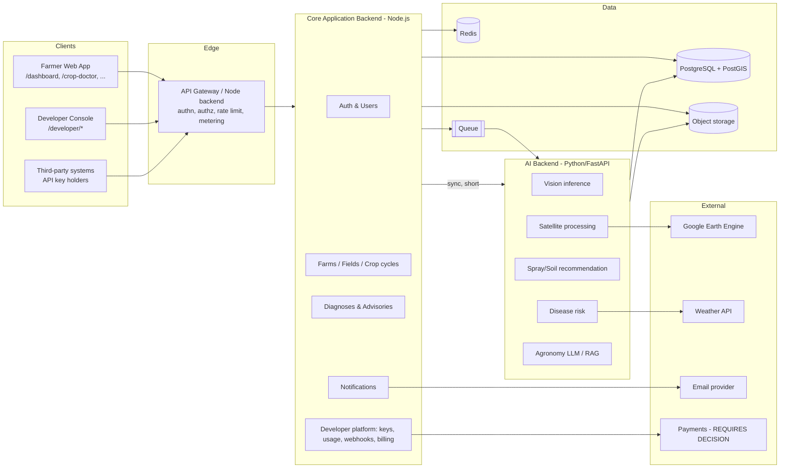
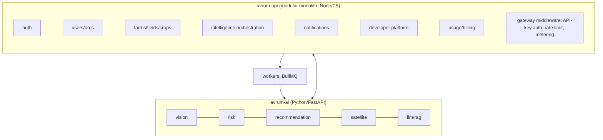
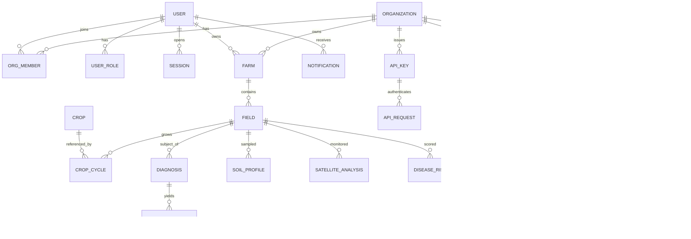
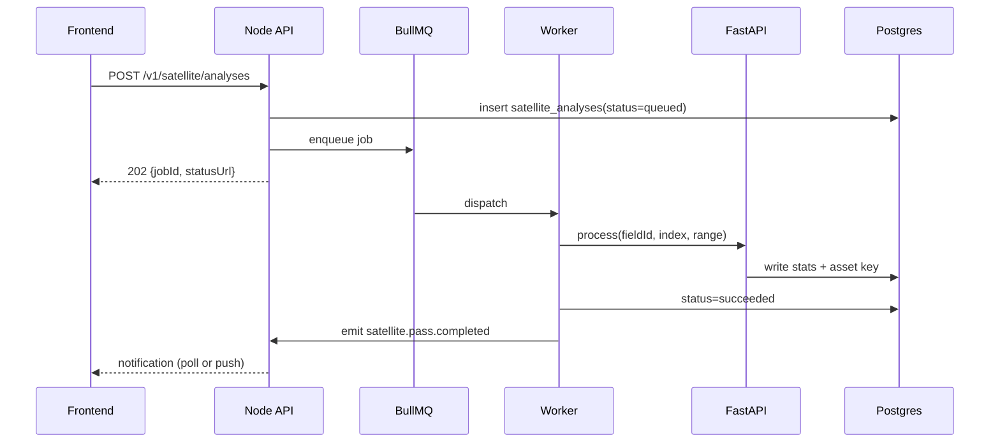
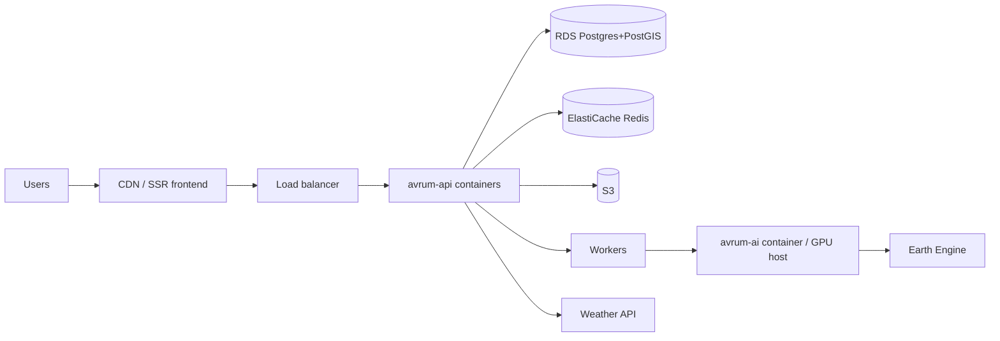

# AVRUM AI — Engineering Guide

> **Audience:** the backend / AI engineer (human or AI agent) taking over this repository to build the server side of AVRUM AI.
> **Status of this document:** derived from a direct inspection of the repository at `/` (TanStack Start frontend). Every claim is labelled.
>
> **Label legend used throughout**
> | Label | Meaning |
> |---|---|
> | `FACT` | Verified by reading the repository. |
> | `INFERENCE` | Reasonably deduced from the UI/code, not explicitly stated anywhere. |
> | `RECOMMENDATION` | Proposed design by the author of this document. |
> | `PROPOSED` | Does not exist; suggested contract/endpoint/entity. |
> | `REQUIRES DECISION` | Product or architecture choice not yet made. |
> | `NOT IMPLEMENTED` | Absent from the codebase. |
>
> **Feature state vocabulary**
> - **IMPLEMENTED** — genuinely works end-to-end today.
> - **FE-ONLY** — frontend implemented / backend missing (mock, hardcoded, or static UI).
> - **NOT IMPLEMENTED** — not meaningfully built.

---

## 1. Executive Summary

**What AVRUM AI is** (`FACT`, from marketing copy, route metadata and product code): an agricultural intelligence platform that gives farmers AI-powered crop diagnosis, disease risk intelligence, spray advisories, satellite field monitoring and soil guidance — positioned for African (initially Nigerian) agriculture. A second surface, **AVRUM Intelligence**, is a developer/API platform that exposes the same agricultural intelligence to external organisations.

**Problem** (`INFERENCE`): smallholder and commercial farmers lack timely, field-specific agronomic diagnosis and treatment guidance; extension services do not scale; satellite/soil/weather data exists but is not translated into actionable, localised decisions.

**Target users** (`FACT` for the roles named in the UI; `INFERENCE` for their exact privileges): individual farmers, commercial farms, cooperatives (the seeded profile is "Agronomy Lead, Sunrise Agro Cooperative"), government agencies and NGOs (named as developer-platform customers), platform administrators (an `/admin` route exists), and external developers/organisations.

**Core products** (`FACT` — each has a route, nav entry and product card):
1. AI Crop Doctor
2. Predictive Disease Intelligence
3. Precision Spray Recommendation
4. Satellite Crop Monitoring
5. Soil Intelligence
6. AVRUM Intelligence — Developer/API platform (packaged as six API products: Crop, Disease, Agricultural AI, Satellite, Soil, Spray)

**Technical vision** (`RECOMMENDATION`, aligned with the stated intent): the current repository is a **presentation-layer-complete, backend-zero** product. The intended shape is a Node.js application backend + a Python AI backend, PostgreSQL as the system of record, object storage for imagery, a queue for long-running AI/satellite work, and an API gateway layer that serves both the first-party frontend and third-party API consumers.

**Current development stage** (`FACT`): **Frontend prototype / design-system phase.** There is **no backend of any kind in this repository** — no database, no auth provider, no server functions, no API client, no environment variables, no external service SDKs. Every screen renders static or empty-state content. See §9 and §10.

---

## 2. Product Overview

For each product below: purpose → workflow → inputs/outputs → AI need → frontend screens → backend need → proposed endpoints → status.

### 2.1 AI Crop Doctor
- **Purpose** (`FACT`, route metadata): "Upload a crop photo for instant AI diagnosis, severity scoring and a treatment plan."
- **User workflow** (`FACT` from UI, `INFERENCE` for the missing steps): open `/crop-doctor` → drag/drop or browse crop images → model runs → diagnosis card with confidence + severity → treatment plan → history list (`Diagnosis history` button exists, no target).
- **Expected inputs** (`INFERENCE`): 1..n images (JPG/PNG ≤10 MB — stated in `UploadZone`), optionally crop type, field/farm id, GPS coordinates, capture timestamp.
- **Expected outputs** (`INFERENCE` from `AIInsightCard` props — `insight`, `recommendation`, `confidence`, `severity`): disease label, confidence 0–1, severity band, agronomic explanation, recommended action, link into Spray Recommendation.
- **AI requirements** (`PROPOSED`): image classification/detection model (Vision Transformer or CNN), per-crop label taxonomy, severity regressor or heuristic from lesion area, calibrated confidence, an "unknown / low confidence / not a plant" reject path.
- **Frontend screens** (`FACT`): `/crop-doctor` only. No result view, no history view exists.
- **Backend requirements** (`PROPOSED`): signed-upload issuance, image validation, inference dispatch, diagnosis persistence, history query, model version stamping.
- **Proposed endpoints:** `POST /v1/uploads/sign`, `POST /v1/crop/diagnose`, `GET /v1/crop/diagnoses`, `GET /v1/crop/diagnoses/:id`.
- **Status:** **FE-ONLY** — and even the frontend is partial: `UploadZone` has drag styling but **no `<input type="file">`, no file state, no upload handler** (`FACT`).

### 2.2 Predictive Disease Intelligence
- **Purpose** (`FACT`): regional outbreak map + disease library.
- **Frontend screens** (`FACT`): `/disease-intelligence` (renders `MapPlaceholder label="Outbreak heatmap"`), `/disease-intelligence/library` (search box + empty state).
- **Inputs** (`PROPOSED`): geography (point/polygon/admin region), crop, weather history + forecast, aggregated platform diagnoses, satellite vegetation stress, seasonality/planting calendar.
- **Risk calculation** (`REQUIRES DECISION`): no model, formula, or thresholds exist in the repository. Options: rules/agro-climatic thresholds per pathogen → gradient-boosted model on historical outbreak labels → spatio-temporal model. Start with rules + observed diagnosis density.
- **Alerts** (`PROPOSED`): threshold crossing per subscribed region/field → notification + `disease.outbreak.detected` webhook (the event name is `FACT` — it is listed in the developer webhooks page).
- **Backend requirements** (`PROPOSED`): weather ingestion, geospatial aggregation of diagnoses (PostGIS), a disease knowledge base (pathogen, hosts, symptoms, conditions, treatments), scheduled risk recomputation, alert fan-out.
- **Proposed endpoints:** `GET /v1/disease/risk?lat=&lon=&crop=`, `GET /v1/disease/outbreaks?bbox=`, `GET /v1/diseases`, `GET /v1/diseases/:slug`.
- **Status:** **FE-ONLY** (map is a static placeholder; library list is empty).

### 2.3 Precision Spray Recommendation
- **Purpose** (`FACT`): "Product, dosage and the safest weather window for each treatment decision."
- **Frontend** (`FACT`): `/spray-recommendation` with a `FilterPanel` containing **non-functional select stubs** for Crop / Field / Target issue, a "Generate advisory" button with no handler, and an empty state.
- **Inputs** (`INFERENCE` + `PROPOSED`): diagnosis id or target pest/disease, crop + growth stage, field geometry/area, severity, current + forecast weather (wind, rain, temperature, humidity), country-registered product catalogue.
- **Outputs** (`PROPOSED`): ranked products with active ingredient, dose per ha, total volume for the field, application window(s), pre-harvest interval, re-entry interval, mixing/safety notes.
- **Country-specific considerations** (`REQUIRES DECISION`): product registration differs per country (NAFDAC in Nigeria, etc.). Requires a curated, country-scoped agro-product catalogue and a legal review of liability wording. No such data exists in the repo.
- **Backend requirements** (`PROPOSED`): product catalogue + registration table, dosage rules engine, weather-window scoring, advisory persistence and audit trail.
- **Proposed endpoints:** `POST /v1/spray/recommend`, `GET /v1/spray/windows?fieldId=`, `GET /v1/spray/products?country=&crop=&target=`.
- **Status:** **FE-ONLY**.

### 2.4 Satellite Crop Monitoring
- **Purpose** (`FACT`): "Vegetation, moisture and stress indices tracked from space, field by field" — NDVI, NDMI, stress layers, index history.
- **Frontend** (`FACT`): `/satellite-monitoring` renders `MapPlaceholder` + empty state; `/farms/fields` renders a "Boundary editor" `MapPlaceholder`. **No mapping library is installed** — no Leaflet, Mapbox, MapLibre, or Google Maps in `package.json`.
- **Inputs** (`PROPOSED`): field boundary polygon (GeoJSON), date range, index type.
- **Outputs** (`PROPOSED`): index time series, per-pass tiles/PNG overlays, zonal statistics, change/stress/drought/flood flags.
- **Backend requirements** (`PROPOSED`): Google Earth Engine (service account) or Sentinel Hub integration, async job pipeline (a pass can take minutes), tile/asset storage in S3, cached index series, cloud-cover filtering, `satellite.pass.completed` event (`FACT`: event name listed in UI).
- **Proposed endpoints:** `POST /v1/satellite/analyses` (async, returns job), `GET /v1/satellite/analyses/:id`, `GET /v1/fields/:id/indices?index=ndvi&from=&to=`.
- **Status:** **FE-ONLY**, and the boundary-capture prerequisite (a real map/drawing tool) is **NOT IMPLEMENTED**.

### 2.5 Soil Intelligence
- **Purpose** (`FACT`): "Nutrient balance, pH and moisture insight translated into fertiliser action." UI offers "Upload soil test".
- **Inputs** (`INFERENCE`): lab report upload (PDF/image/CSV), or manual N-P-K/pH/OC entry, field id, crop history. UI hint: "Sample 3 points per hectare, 0–20 cm depth".
- **Outputs** (`PROPOSED`): nutrient gap analysis, fertiliser plan (product, rate, split timing), irrigation guidance, crop suitability ranking.
- **Backend requirements** (`PROPOSED`): soil profile storage, optional lab-report parsing (OCR — `REQUIRES DECISION`), fallback soil property estimates from external datasets (e.g. iSDAsoil/SoilGrids — `REQUIRES DECISION`), fertiliser recommendation rules per crop/target yield, `soil.report.ready` event (`FACT`: name listed in UI).
- **Proposed endpoints:** `POST /v1/soil/profiles`, `POST /v1/soil/analyze`, `GET /v1/fields/:id/soil`.
- **Status:** **FE-ONLY** (upload button has no handler; empty state only).

### 2.6 AVRUM Intelligence — Developer / API Platform
- **Purpose** (`FACT`): let external developers, startups, agribusinesses, NGOs and governments consume Avrum's agricultural intelligence via APIs. Six API products are catalogued in `src/lib/developer.ts` with slugs, statuses, capabilities, endpoint method+path and request counts.
- **Catalogue as declared in code (`FACT`)**

  | Slug | Status | Declared endpoint |
  |---|---|---|
  | `crop-intelligence` | stable | `POST /v1/crop/analyze` |
  | `disease-intelligence` | stable | `GET /v1/disease/risk` |
  | `agricultural-ai` | beta | `POST /v1/ai/diagnose` |
  | `satellite-intelligence` | beta | `GET /v1/satellite/ndvi` |
  | `soil-intelligence` | preview | `GET /v1/soil/profile` |
  | `spray-intelligence` | coming-soon | `POST /v1/spray/windows` |

  These paths are **UI copy only** — nothing serves them (`FACT`). Treat them as the naming intent, but reconcile with the farmer-facing endpoints in §17 rather than maintaining two vocabularies.
- **Frontend screens** (`FACT`): Overview, Playground (all controls disabled/static), API Products, API Keys (4 hardcoded keys), Usage, Documentation, Logs (duplicated mock rows), Webhooks (empty state + 4 event names), Team, Billing, Settings — all under the `/developer/*` URL space via the `_dev` layout.
- **Backend requirements** (`PROPOSED`): organisations, developer members, hashed API keys with environments and scopes, gateway auth + rate limiting, per-request metering, log storage, webhook registration + signed delivery + retries, plans/quotas/billing.
- **Status:** **FE-ONLY** across every page.

---

## 3. Product Architecture



`RECOMMENDATION`: one Node process (modular monolith) + one Python AI service + workers. Do not start with microservices (§13).

---

## 4. User Types & RBAC

### 4.1 What exists today (`FACT`)
- **There is no authentication, no session, no user object and no role enforcement anywhere in the repository.**
- The only role-ish artefacts are:
  - `NavItem.adminOnly?: boolean` in `src/lib/nav.ts`, set on the Admin item. Grep shows the flag is declared; the sidebar renders nav data — **the flag is metadata, not a guard** (`FACT`). No route protection exists.
  - `/admin` renders an alert reading "Access is enforced server-side once authentication is connected" (`FACT` — an explicit admission of FE-ONLY).
  - `src/lib/profile.ts` exports a hardcoded `currentProfile` with `role: "Agronomy Lead"` — a display string, not an authorisation role (`FACT`).
  - Onboarding collects a "role" and an experience level as form fields held in local component state only (`FACT`).
- **Conclusion:** RBAC is **NOT IMPLEMENTED**. All role behaviour is visual.

### 4.2 Recommended backend RBAC (`RECOMMENDATION` / `PROPOSED`)

Two orthogonal dimensions:

1. **Platform role** (on the user): `farmer`, `agronomist`, `admin`, `support`.
2. **Organisation membership role** (user × organisation): `owner`, `admin`, `member`, `viewer`, `billing`.

| Actor | Scope of data | Key permissions |
|---|---|---|
| Individual farmer | Own farms/fields/diagnoses | CRUD own farms, run AI, view own history, manage own profile |
| Commercial farm | Org-owned farms | + invite members, assign fields, export data |
| Cooperative | Org with many member farms | + aggregate dashboards across member farms; member consent model `REQUIRES DECISION` |
| Government agency / NGO | Region-scoped **aggregated** data | Read anonymised/aggregated outbreak + adoption stats; never raw farmer PII by default (`REQUIRES DECISION`) |
| External developer org | Own API keys, usage, logs, webhooks | Manage keys/scopes, read own usage, no access to farmer records |
| Administrator | Platform-wide | User/org management, model rollout, data-quality tooling, audit log read |

`RECOMMENDATION`: store roles in dedicated tables (`user_roles`, `organization_members`) — never as a column on the profile — and evaluate permissions server-side on every request. API-key requests carry an **organisation identity, not a user identity**; scope every developer endpoint by `organization_id`.

---

## 5. Current Frontend Architecture (`FACT` unless noted)

| Concern | Actual implementation |
|---|---|
| Framework | React 19 + **TanStack Start v1** (SSR-capable, file-based routing) |
| Build tool | Vite 8, `@tailwindcss/vite`, `@tanstack/router-plugin`, `vite-tsconfig-paths` |
| Language | TypeScript 5.8, strict-style config, `@/*` path alias |
| CSS | Tailwind CSS v4, single source of truth `src/styles.css` (`@theme`, OKLCH tokens, custom `@utility` classes such as `text-metric`, `text-overline`, `text-section-title`) |
| UI library | shadcn/ui pattern over Radix primitives — 45 components in `src/components/ui/` |
| Design tokens | Semantic only: `primary`, `brand`, `emerald` (AI), `sky` (data), `success/warning/destructive`, `*-soft` variants, shadow + radius scales. Dark mode via `.dark` class |
| Typography | Sora (display) + Manrope (body), loaded via `<link>` in `__root.tsx` |
| Icons | `lucide-react` exclusively |
| State management | **React local state only** (`useState`/`useMemo`/`useContext`). No Redux/Zustand/Jotai. `QueryClientProvider` is mounted in `__root.tsx` and a `QueryClient` is in router context — **but there is not a single `useQuery`/`useMutation` call in the app** |
| Routing | TanStack Router file-based, flat dot notation in `src/routes/`; layouts `_app` (farmer), `_auth`, `_dev` (developer), plus standalone `index.tsx` (marketing) and `onboarding.tsx` |
| Authentication | **None.** Auth pages simulate with `setTimeout` + `toast` + `navigate` |
| Data fetching | **None.** Zero `fetch`, zero `axios`, zero `createServerFn`, zero API base URL |
| Forms | Native `<form onSubmit>` in auth pages; `react-hook-form` + `@hookform/resolvers` are installed but **not used in any page** |
| Validation | `zod` schemas in `src/lib/auth-validation.ts` (sign-in, sign-up, forgot/reset password), applied client-side in auth pages |
| Charts | `recharts` + `src/components/ui/chart.tsx` installed; usage limited to developer usage/statistical UI — no live data |
| Maps | **None installed.** `MapPlaceholder` is a decorative div |
| File uploads | **None.** `UploadZone` has drag-over styling only — no file input, no state, no handler |
| i18n | **None.** No i18n library, no message catalogue. `/profile/language` is a static preference UI |
| Notifications (UX) | `sonner` toasts (`<Toaster />` mounted in shells); `NotificationMenu` dropdown with 3 hardcoded items |
| Error handling | `__root.tsx` `errorComponent` + `notFoundComponent`; `src/lib/error-capture.ts`, `src/lib/error-page.ts`, `src/lib/lovable-error-reporting.ts`; `src/server.ts` normalises catastrophic SSR responses |
| Persistence | `localStorage` used in exactly one place: theme (`avrum-theme`) in `src/components/theme/theme-provider.tsx` |
| Env vars | **No `.env`, no `.env.example`, no `import.meta.env.VITE_*`, no `process.env` reads in app code** |

---

## 6. Repository Structure (`FACT`)

```
/
├── AGENTS.md, README.md, components.json, package.json
├── vite.config.ts, tsconfig.json, eslint.config.js, .prettierrc
├── public/                       # robots.txt, favicon
└── src/
    ├── routes/                   # TanStack file-based routes (flat, dot notation)
    │   ├── __root.tsx            # html shell, head meta, QueryClientProvider, error/404
    │   ├── index.tsx             # marketing landing page
    │   ├── onboarding.tsx        # 11-step wizard (672 lines, local state)
    │   ├── _auth.*.tsx           # sign-in/up, verify, forgot/reset, account-created
    │   ├── _app.*.tsx            # farmer workspace (dashboard, farms, 5 products, profile*, settings, help, admin, notifications)
    │   └── _dev.*.tsx            # developer platform (11 pages)
    ├── routeTree.gen.ts          # GENERATED — never edit
    ├── router.tsx                # createRouter + QueryClient context
    ├── server.ts                 # SSR fetch entry + error normalisation
    ├── start.ts
    ├── styles.css                # entire design system
    ├── components/
    │   ├── ui/                   # 45 shadcn/Radix primitives
    │   ├── avrum/                # domain primitives: PageShell, PageHeader, Section,
    │   │                         #   StatCard, AIInsightCard, DataTable, EmptyState,
    │   │                         #   FilterPanel, SearchBox, SettingsCard, UploadZone,
    │   │                         #   MapPlaceholder, Loading
    │   ├── layout/               # AppShell, AppSidebar, TopNav, MobileBottomNav,
    │   │                         #   NotificationMenu, Logo
    │   ├── developer/            # DeveloperShell/Sidebar/Header, WorkspaceSwitcher,
    │   │                         #   APIProductCard, APIStatCard, UsageCard,
    │   │                         #   APIActivityRow, GettingStartedCard, QuickActionCard,
    │   │                         #   badges (Endpoint/Status), states (empty/loading/error)
    │   ├── marketing/            # hero, features, products, stats, FAQ, footer, etc.
    │   ├── auth/                 # AuthShell/Card/Field, PasswordInput, strength meter, OAuth buttons
    │   ├── onboarding/           # StepCard, StepNav, OnboardingProgress, AutosaveIndicator, OptionCard
    │   ├── profile/              # ProfileNav, ProfileIdentityCard
    │   └── theme/                # ThemeProvider (localStorage)
    ├── hooks/                    # use-mobile.tsx ONLY
    └── lib/                      # nav.ts, developer.ts, profile.ts, auth-validation.ts,
                                  # utils.ts (cn), error-capture.ts, error-page.ts,
                                  # lovable-error-reporting.ts
```

**Notable absences** (`FACT`): no `src/services/`, no `src/api/`, no `src/types/`, no `src/store/`, no `src/i18n/`, no tests, no Dockerfile, no CI config, no backend directory.

**Naming conventions** (`FACT`): kebab-case files; PascalCase components; route files mirror URL with dots; domain data lives in `src/lib/*.ts` as typed exported constants; barrel `index.ts` per component folder.

---

## 7. Route Inventory (`FACT` — every route file in `src/routes/`)

| Route | Page | User type | Purpose | Backend dependency | Status |
|---|---|---|---|---|---|
| `/` | Marketing landing | Public | Hero, products, stats, testimonials, FAQ, newsletter | Newsletter subscribe; CMS optional | FE-ONLY |
| `/sign-in` | Sign in | Public | Email + password login | `POST /auth/login` | FE-ONLY (setTimeout simulation) |
| `/sign-up` | Sign up | Public | Register (name, org, email, password, terms) | `POST /auth/register` | FE-ONLY |
| `/verify-email` | Verify email | Public | OTP entry + resend cooldown | `POST /auth/verify-email`, `/resend` | FE-ONLY |
| `/account-created` | Success | Public | Post-signup confirmation | — | IMPLEMENTED (static) |
| `/forgot-password` | Forgot password | Public | Request reset link | `POST /auth/forgot-password` | FE-ONLY |
| `/reset-password` | Reset password | Public | Set new password from token | `POST /auth/reset-password` | FE-ONLY |
| `/onboarding` | 11-step wizard | New user | Profile, farm, boundary, location, crops, goals, channels | `POST /onboarding` / farm+profile writes | FE-ONLY (state discarded on reload) |
| `/dashboard` | Farm overview | Farmer | Stats, map, activity, AI next-step | Dashboard aggregate API | FE-ONLY (zeros/em-dashes) |
| `/farms` | All farms | Farmer | Farm list | `GET/POST /farms` | FE-ONLY (empty state) |
| `/farms/fields` | Field boundaries | Farmer | Draw/edit polygons | Fields API + map lib | FE-ONLY (placeholder) |
| `/farms/calendar` | Crop calendar | Farmer | Season/crop-cycle timeline | Crop cycles API | FE-ONLY |
| `/crop-doctor` | AI Crop Doctor | Farmer | Image → diagnosis | Upload + inference + history | FE-ONLY |
| `/disease-intelligence` | Outbreak map | Farmer | Regional risk heatmap | Risk + geo API | FE-ONLY |
| `/disease-intelligence/library` | Disease library | Farmer | Browse pathogens | Disease KB API | FE-ONLY |
| `/spray-recommendation` | Spray advisory | Farmer | Generate treatment plan | Recommendation + weather | FE-ONLY |
| `/satellite-monitoring` | Satellite | Farmer | NDVI/NDMI/stress viewer | GEE pipeline | FE-ONLY |
| `/soil-intelligence` | Soil | Farmer | Soil tests → fertiliser plan | Soil API + upload | FE-ONLY |
| `/notifications` | Inbox | Farmer | Alert list + search | Notifications API | FE-ONLY |
| `/settings` | App settings | Farmer | Workspace preferences | Settings API | FE-ONLY |
| `/help` | Help centre | Farmer | FAQ + search | CMS/support | FE-ONLY |
| `/admin` | Admin console | Admin | Users, models, data quality | Admin APIs + RBAC | NOT IMPLEMENTED (empty state) |
| `/profile` | Profile overview | Any | Identity summary | `GET /me` | FE-ONLY (hardcoded profile) |
| `/profile/edit` | Edit profile | Any | Name, photo, contact, bio | `PATCH /me` | FE-ONLY |
| `/profile/account` | Account | Any | Email, phone, org, lifecycle | Account APIs | FE-ONLY |
| `/profile/security` | Security | Any | Password, 2FA, sessions | Auth APIs | FE-ONLY |
| `/profile/notifications` | Notification prefs | Any | Channel/topic matrix | Prefs API | FE-ONLY |
| `/profile/language` | Language & region | Any | Language, units, date format | Prefs API + i18n | FE-ONLY |
| `/profile/appearance` | Appearance | Any | Theme, density, motion | Client-side (theme works) | Partially IMPLEMENTED (theme toggle persists) |
| `/profile/subscription` | Subscription | Any | Plan placeholder (badge "Soon") | Billing | NOT IMPLEMENTED |
| `/profile/devices` | Devices | Any | Sessions placeholder ("Soon") | Session store | NOT IMPLEMENTED |
| `/profile/activity` | Activity log | Any | Audit placeholder ("Soon") | Audit log | NOT IMPLEMENTED |
| `/developer` | Dev overview | Developer | Stats, products, activity, checklist | Many | FE-ONLY (mock numbers) |
| `/developer/playground` | Playground | Developer | Compose/send request | Gateway + sandbox | FE-ONLY (send disabled) |
| `/developer/api-products` | Catalogue | Developer | Browse 6 products | Catalogue API | FE-ONLY (static array) |
| `/developer/api-keys` | Keys | Developer | List/create/rotate keys | Key service | FE-ONLY (4 fake keys) |
| `/developer/usage` | Usage | Developer | Consumption analytics | Metering | FE-ONLY |
| `/developer/docs` | Documentation | Developer | Reference/quickstarts | Docs source | FE-ONLY (static) |
| `/developer/logs` | Logs | Developer | Request log stream | Log store | FE-ONLY (duplicated mock rows) |
| `/developer/webhooks` | Webhooks | Developer | Endpoints + event list | Webhook service | FE-ONLY (empty state) |
| `/developer/team` | Team | Developer | Members/invites | Org membership | FE-ONLY |
| `/developer/billing` | Billing | Developer | Plan/invoices | Billing + provider | FE-ONLY |
| `/developer/settings` | Dev settings | Developer | Org/API preferences | Settings API | FE-ONLY |

`FACT`: `/developer/*` is served through the pathless `_dev` layout (`DeveloperShell` — own sidebar, header, workspace switcher, mobile bottom nav). The farmer workspace uses `_app` → `AppShell`. **Both are publicly reachable; nothing gates either.**

---

## 8. Frontend Feature → Backend Requirement Matrix

| Frontend feature | UI exists | API needed (`PROPOSED`) | DB needed | AI needed | External service | Status |
|---|---|---|---|---|---|---|
| Registration / login | Yes | `POST /v1/auth/register`, `/login`, `/refresh`, `/logout` | User, Session | No | Email | FE-ONLY |
| Email verification | Yes (OTP UI) | `POST /v1/auth/verify-email`, `/resend` | VerificationToken | No | Email | FE-ONLY |
| Password reset | Yes | `POST /v1/auth/forgot-password`, `/reset-password` | ResetToken | No | Email | FE-ONLY |
| OAuth buttons | Yes (visual) | OAuth callback routes | Identity | No | Google/Apple `REQUIRES DECISION` | FE-ONLY (no handlers) |
| Onboarding wizard | Yes | `POST /v1/onboarding` (or granular writes) | User, Farm, Field, Crop, Preferences | No | — | FE-ONLY |
| Farmer dashboard | Yes | `GET /v1/dashboard` | Aggregates | No | — | FE-ONLY |
| Farm CRUD | Partial (empty states) | `GET/POST/PATCH/DELETE /v1/farms` | Farm | No | — | FE-ONLY |
| Field boundaries | Placeholder | `POST /v1/farms/:id/fields` (GeoJSON) | Field + PostGIS | No | Map tiles provider | FE-ONLY + map lib missing |
| Crop calendar | Placeholder | `GET/POST /v1/crop-cycles` | CropCycle | No | — | FE-ONLY |
| Crop image upload | Drag UI only | `POST /v1/uploads/sign` | Media | No | S3 | Not functional |
| Crop diagnosis | Yes (empty) | `POST /v1/crop/diagnose` | Diagnosis, AIInference | **Vision model** | S3, GPU | FE-ONLY |
| Diagnosis history | Button only | `GET /v1/crop/diagnoses` | Diagnosis | No | — | NOT IMPLEMENTED |
| Disease risk map | Placeholder | `GET /v1/disease/risk`, `/outbreaks` | DiseaseRisk, WeatherSnapshot | Risk model | Weather | FE-ONLY |
| Disease library | Yes (empty) | `GET /v1/diseases` | Disease KB | No | — | FE-ONLY |
| Spray advisory | Yes (stubs) | `POST /v1/spray/recommend` | Recommendation, Product | Rules/LLM | Weather | FE-ONLY |
| Satellite indices | Placeholder | `POST /v1/satellite/analyses` (async) | SatelliteAnalysis | Processing | Google Earth Engine | FE-ONLY |
| Soil analysis | Yes (empty) | `POST /v1/soil/analyze` | SoilProfile | Rules (+OCR?) | Soil dataset | FE-ONLY |
| Notifications inbox | Yes (mock) | `GET /v1/notifications`, `PATCH /:id/read` | Notification | No | Email/SMS later | FE-ONLY |
| Notification prefs | Yes | `GET/PUT /v1/me/preferences` | Preferences | No | — | FE-ONLY |
| Profile view/edit | Yes (hardcoded) | `GET/PATCH /v1/me` | User | No | S3 (avatar) | FE-ONLY |
| Security / 2FA / sessions | Yes (static) | `POST /v1/me/password`, `/mfa`, `GET /v1/me/sessions` | Session, MfaSecret | No | — | FE-ONLY |
| Theme preference | Yes | — (client) | optional | No | — | **IMPLEMENTED** |
| Admin console | Empty state | Admin APIs | Roles, AuditLog | No | — | NOT IMPLEMENTED |
| Developer overview stats | Yes (mock) | `GET /v1/developer/summary` | APIUsage | No | — | FE-ONLY |
| API key management | Yes (mock) | `GET/POST/DELETE /v1/developer/api-keys` | APIKey | No | — | FE-ONLY |
| API playground | Yes (disabled) | Gateway proxy `POST /v1/playground/execute` | APIRequest | Downstream | — | FE-ONLY |
| Usage analytics | Yes (mock) | `GET /v1/developer/usage` | APIUsage rollups | No | — | FE-ONLY |
| Request logs | Yes (mock) | `GET /v1/developer/logs` | APIRequest | No | — | FE-ONLY |
| Webhooks | Empty state | `POST /v1/developer/webhooks`, deliveries | Webhook, WebhookDelivery | No | — | FE-ONLY |
| Team management | Yes (static) | `GET/POST /v1/organizations/:id/members` | Organization, Member, Invite | No | Email | FE-ONLY |
| Developer billing | Yes (static) | `GET /v1/billing/*` | Plan, Subscription, Invoice | No | Payment provider `REQUIRES DECISION` | FE-ONLY |
| Newsletter signup | Yes | `POST /v1/newsletter` | Subscriber | No | Email/ESP | FE-ONLY |
| Help centre | Yes (static) | Content API optional | Article | No | — | FE-ONLY |

---

## 9. Current Implementation Status (master table)

| Component | Frontend | Backend | Database | AI | External | Status | Priority |
|---|---|---|---|---|---|---|---|
| Design system / UI kit | Complete | n/a | n/a | n/a | n/a | IMPLEMENTED | — |
| Routing & layouts | Complete | n/a | n/a | n/a | n/a | IMPLEMENTED | — |
| SSR + error boundaries | Complete | n/a | n/a | n/a | n/a | IMPLEMENTED | — |
| Theme (light/dark) | Complete | n/a | n/a | n/a | n/a | IMPLEMENTED | — |
| Marketing site | Complete | Missing | Missing | n/a | Email (newsletter) | FE-ONLY | P3 |
| Authentication | Complete (simulated) | Missing | Missing | n/a | Email | FE-ONLY | **P0** |
| Onboarding | Complete (local) | Missing | Missing | n/a | — | FE-ONLY | P1 |
| Farms / fields / calendar | Shell only | Missing | Missing | n/a | Maps | FE-ONLY | **P0/P1** |
| AI Crop Doctor | Partial (no upload) | Missing | Missing | Planned | S3, GPU | FE-ONLY | P1 |
| Disease Intelligence | Shell only | Missing | Missing | Planned | Weather | FE-ONLY | P2 |
| Spray Recommendation | Shell only | Missing | Missing | Planned | Weather | FE-ONLY | P2 |
| Satellite Monitoring | Placeholder | Missing | Missing | Planned | GEE | FE-ONLY | P2 |
| Soil Intelligence | Shell only | Missing | Missing | Planned | Soil data | FE-ONLY | P2 |
| Notifications | Mock | Missing | Missing | n/a | Email/SMS | FE-ONLY | P1 |
| Profile & settings | Complete (static) | Missing | Missing | n/a | S3 | FE-ONLY | P1 |
| Admin | Empty state | Missing | Missing | n/a | — | NOT IMPLEMENTED | P3 |
| Developer console (11 pages) | Complete (mock) | Missing | Missing | n/a | — | FE-ONLY | P2 |
| Public API gateway | n/a | Missing | Missing | n/a | — | NOT IMPLEMENTED | P2 |
| Billing | Static | Missing | Missing | n/a | Provider TBD | NOT IMPLEMENTED | P3 |
| i18n | None | Missing | Missing | n/a | — | NOT IMPLEMENTED | P3 |
| Offline / PWA | None | n/a | n/a | n/a | — | NOT IMPLEMENTED | P3 |
| Tests | None | Missing | n/a | n/a | — | NOT IMPLEMENTED | P1 |

---

## 10. Mocked / Placeholder Functionality (exhaustive, `FACT`)

| # | Location | What it simulates | Replace with |
|---|---|---|---|
| 1 | `src/lib/profile.ts` → `currentProfile` | Logged-in user identity (name, email, phone, org, location, member-since, bio) | `GET /v1/me` |
| 2 | `src/lib/developer.ts` → `apiProducts` (6 items incl. `requests: "128,400"`) | API catalogue + lifetime request counts | `GET /v1/developer/products` + metering rollups |
| 3 | `src/lib/developer.ts` → `recentApiActivity` (6 rows) | Live request stream (method, status, latency, key, relative time) | `GET /v1/developer/logs` |
| 4 | `src/lib/developer.ts` → `gettingStartedSteps` (2 of 5 marked done) | Onboarding progress for developers | Derived from real org state |
| 5 | `src/routes/_dev.developer.index.tsx` | Hardcoded stats: `509,830` requests, `99.72%` success, `214 ms` latency, `4` active keys; quota cards `412/1000`, `509830/750000` | `GET /v1/developer/summary`, `/usage` |
| 6 | `src/routes/_dev.developer.api-keys.tsx` → `keys[]` | 4 fake keys (`avr_live_a91•••`, `avr_test_7f2•••`) with scopes/last-used | `GET /v1/developer/api-keys` |
| 7 | `src/routes/_dev.developer.logs.tsx` | Duplicates `recentApiActivity` twice to fake volume | Paginated log query |
| 8 | `src/routes/_dev.developer.usage.tsx` | Static consumption/per-product charts | Metering rollups |
| 9 | `src/routes/_dev.developer.webhooks.tsx` → `events[]` | 4 event names (`disease.outbreak.detected`, `satellite.pass.completed`, `spray.window.opened`, `soil.report.ready`) | Real event registry + deliveries |
| 10 | `src/routes/_dev.developer.playground.tsx` | Request composer; **Send button `disabled`**, no execution | Gateway execute endpoint |
| 11 | `src/routes/_dev.developer.team.tsx` / `.billing.tsx` / `.settings.tsx` / `.docs.tsx` | Static members, plan, preferences, docs copy | Org, billing, settings, docs APIs |
| 12 | `src/components/layout/notification-menu.tsx` → `items[]` | 3 fake alerts (blight risk, satellite pass, spray window) | `GET /v1/notifications?unread=true` |
| 13 | `src/routes/_app.notifications.tsx` | Inbox shell + non-functional search | Notifications API + server-side search |
| 14 | `src/routes/_app.dashboard.tsx` | Stats hardcoded to `0` / `"—"`, `confidence={0}` insight | `GET /v1/dashboard` |
| 15 | `src/components/avrum/map-placeholder.tsx` (used on dashboard, fields, disease, satellite) | Any map: field overview, boundary editor, outbreak heatmap, NDVI layer | Real map component + geo APIs |
| 16 | `src/components/avrum/upload-zone.tsx` | File upload; **no file input or handler** | Real uploader → signed S3 URL |
| 17 | `src/routes/_auth.sign-in.tsx`, `_auth.sign-up.tsx`, `_auth.forgot-password.tsx`, `_auth.reset-password.tsx`, `_auth.verify-email.tsx` | Auth via `window.setTimeout(...)` → toast → `navigate` | Real auth endpoints + session |
| 18 | `src/components/auth/oauth-providers.tsx` | Social sign-in buttons with no handler | OAuth flows (`REQUIRES DECISION`) |
| 19 | `src/routes/onboarding.tsx` | 11-step wizard whose `draft` lives in `useState`; `saveAndContinue()` only fires a toast; `AutosaveIndicator` fakes saving with `setTimeout` | Draft persistence + final commit |
| 20 | `src/routes/_app.spray-recommendation.tsx` → `SelectStub` | Crop/Field/Issue selectors | Real selects bound to farm data |
| 21 | `src/routes/_app.disease-intelligence.library.tsx`, `_app.help.tsx` | Search boxes with no query wiring | Search endpoints |
| 22 | `src/routes/_app.profile.*` | Every settings toggle/field is uncontrolled display markup; sessions/devices/activity/subscription are labelled "Soon" | Preferences, sessions, audit, billing APIs |
| 23 | `src/components/marketing/*` (`stats.tsx`, `testimonials.tsx`, `trusted-by.tsx`, `newsletter.tsx`) | Adoption numbers, quotes, logos, newsletter submit | CMS/ESP (low priority) |
| 24 | `src/routes/_app.admin.tsx` | Admin tooling; alert explicitly says enforcement is not connected | Admin APIs + RBAC |

**Nothing in the repository reads or writes a network resource other than Google Fonts** (`FACT`).

---

## 11. Backend Requirements (summary of what must exist)

`PROPOSED`, derived from §8:
1. **Identity**: registration, email verification, login, refresh, logout, password reset, MFA, sessions/devices, profile, preferences.
2. **Tenancy**: organisations, memberships, invitations, roles, per-organisation data isolation.
3. **Agronomic domain**: farms, fields (geometry), crops, crop cycles, calendar events.
4. **Intelligence**: diagnoses, disease risk, spray advisories, soil profiles/analyses, satellite analyses — each persisted with model/version, inputs, outputs, confidence.
5. **Media**: signed uploads, image validation, derived thumbnails, retention.
6. **Events & notifications**: in-app inbox, email, preference-aware fan-out, future SMS/WhatsApp.
7. **Developer platform**: API keys, gateway auth, scopes, rate limits, metering, logs, webhooks, plans/billing.
8. **Platform**: audit log, admin tooling, model registry, background jobs, observability.

---

## 12. Recommended Backend Architecture

`RECOMMENDATION` — evaluated against the actual frontend and a two-developer team.

| Layer | Choice | Verdict / reasoning |
|---|---|---|
| Application backend | **Node.js + Express (or Fastify) + TypeScript** | ✅ Keep. Shares TypeScript and the existing `zod` schemas (`src/lib/auth-validation.ts` is explicitly written to be reused server-side). Fastify is a reasonable swap for throughput; Express is fine to start. |
| AI backend | **Python + FastAPI** | ✅ Keep. Mandatory for PyTorch/GEE/geospatial ecosystems. Expose an internal-only HTTP contract. |
| Primary DB | **PostgreSQL + PostGIS** | ✅ Keep, and **PostGIS is non-negotiable** — field boundaries, outbreak geography and satellite zonal stats are all spatial. |
| Secondary DB | MongoDB | ⚠️ **Defer.** The only genuine candidates are raw AI payloads, request logs and satellite index blobs. Postgres `JSONB` covers all of them at current scale. Introduce Mongo (or ClickHouse/Timescale for logs) only when volume forces it. Adding a second database on day one costs a two-person team more than it saves. |
| Cache | **Redis** | ✅ Keep — rate limiting, API-key lookup cache, job queue backend, session/refresh-token denylist, weather response cache. |
| Queue | **BullMQ on Redis** initially | ✅ Recommended over SQS/RabbitMQ/Kafka for phase 1: you already need Redis, it has retries/backoff/scheduling/dashboards, and it is trivial for two developers. Move to SQS when you need cross-cloud durability, or Kafka only if event streaming becomes a product. Python workers can consume via a thin HTTP-dispatch worker or `bullmq`-compatible client — or run Celery on the same Redis for the Python side (`REQUIRES DECISION`: single BullMQ + HTTP-to-FastAPI vs. dual BullMQ/Celery). |
| Object storage | **AWS S3** (or S3-compatible) | ✅ Keep. Direct-to-S3 signed uploads; never proxy images through Node. |
| AI framework | **PyTorch** (ViT/CNN for vision) | ✅ Keep as the training/inference stack; see §19 on model reality. |
| Satellite | **Google Earth Engine** | ✅ Keep for NDVI/NDMI/time series. Note GEE is Python/JS-only and rate-limited → belongs behind the async pipeline, never in a request path. Sentinel Hub is the fallback if GEE licensing blocks commercial use (`REQUIRES DECISION`). |
| Weather | **OpenWeather** | ✅ Acceptable to start. Evaluate a provider with better African forecast skill later; keep the integration behind an interface. |
| Auth | Email + password, JWT access + rotating refresh | ✅ Matches the UI exactly (sign-in/up, OTP verify, forgot/reset). OAuth buttons exist visually — confirm before building. |
| Deployment | Docker + AWS | ✅ Keep, but start small (§32). |
| GPU | Dedicated inference host | ✅ Needed only once a real vision model exists; run CPU inference or a managed endpoint first. |

---

## 13. Service Boundaries

`RECOMMENDATION`: **two deployables + workers**, with strong internal module boundaries.



| Module | Home | Separate service? |
|---|---|---|
| Auth, Users, Orgs, Farms, Notifications, Developer platform, Usage/Billing | `avrum-api` modules | **No** — modular monolith |
| API gateway for third parties | Middleware in `avrum-api` initially | Split out only when third-party traffic threatens first-party latency |
| Vision / risk / recommendation / satellite / LLM | `avrum-ai` | **Yes** — different language, dependencies and hardware profile |
| Satellite processing | Worker pool inside `avrum-ai` | Split when GEE jobs dominate resource use |
| Notification delivery, satellite jobs, batch inference | Worker processes (same image as `avrum-api`/`avrum-ai`) | Separate **processes**, not separate services |

Rule: a module becomes a service only when it needs a different runtime, a different scaling curve, or a different failure domain.

---

## 14. Database Architecture

`RECOMMENDATION`:
- **PostgreSQL + PostGIS** — everything relational and spatial (users, orgs, farms, fields, crops, cycles, diagnoses, advisories, soil, notifications, API keys, webhooks, plans, invoices, audit).
- **Postgres JSONB** — raw AI outputs, satellite index series, request/response snapshots.
- **Redis** — cache, rate limits, queue, ephemeral state.
- **S3** — images, lab reports, satellite tiles, exports.
- **MongoDB** — `REQUIRES DECISION`; only if log/inference volume outgrows Postgres. Prefer a time-series/analytics store (Timescale/ClickHouse) for `api_requests` over Mongo if that day comes.

Conventions (`RECOMMENDATION`): UUID v7 primary keys, `created_at`/`updated_at` on every table, soft delete only where the product needs restore, all money in minor units, all timestamps UTC, migrations checked in and reproducible.

---

## 15. Database Schema (`PROPOSED`)



| Entity | DB | Purpose | Key fields | Relationships | Indexes |
|---|---|---|---|---|---|
| `users` | PG | Identity | id, email (citext unique), password_hash, full_name, phone, avatar_url, locale, timezone, email_verified_at, status | → sessions, farms, org_members | unique(email) |
| `sessions` | PG | Refresh-token/device tracking (powers `/profile/devices`) | id, user_id, refresh_token_hash, user_agent, ip, last_seen_at, revoked_at, expires_at | user | (user_id, revoked_at) |
| `verification_tokens` | PG | Email OTP + password reset | id, user_id, type, token_hash, expires_at, consumed_at | user | (user_id, type) |
| `user_roles` | PG | Platform roles — **separate table, never a column** | user_id, role enum | user | unique(user_id, role) |
| `organizations` | PG | Farm business, cooperative, NGO, developer org | id, name, slug, type, country, billing_email | → members, farms, api_keys | unique(slug) |
| `organization_members` | PG | Membership + org role | org_id, user_id, role, invited_by, joined_at | both | unique(org_id,user_id) |
| `farms` | PG | Farm record | id, owner_user_id?, org_id?, name, country, state, locality, size, size_unit, ownership_type, centroid geography(Point) | → fields | GIST(centroid) |
| `fields` | PG | Field/plot with geometry | id, farm_id, name, boundary geography(Polygon), area_ha, notes | → cycles, diagnoses | GIST(boundary) |
| `crops` | PG | Reference crop catalogue | id, slug, name, scientific_name, growth_stages jsonb | — | unique(slug) |
| `crop_cycles` | PG | Planting → harvest (powers calendar) | id, field_id, crop_id, variety, planted_on, expected_harvest_on, status | field, crop | (field_id, planted_on) |
| `diseases` | PG | Pathogen knowledge base | id, slug, name, pathogen_type, hosts[], symptoms, favourable_conditions jsonb, treatments jsonb | — | unique(slug), GIN(hosts) |
| `media` | PG | Uploaded assets | id, owner_id, org_id?, s3_key, mime, bytes, checksum, kind, status | — | (owner_id, created_at) |
| `diagnoses` | PG | Crop Doctor result | id, user_id, field_id?, crop_id?, media_ids[], disease_id?, label, confidence, severity, model_version_id, raw jsonb, location geography(Point), status | user, field, model_version | (user_id, created_at), (field_id) |
| `recommendations` | PG | Spray/fertiliser advisory | id, diagnosis_id?, field_id, type, payload jsonb (products, doses, windows), generated_by, model_version_id, valid_until | diagnosis, field | (field_id, created_at) |
| `agro_products` | PG | Country-registered inputs | id, name, active_ingredient, category, country, registration_no, targets[], dose_rules jsonb | — | (country, category) |
| `soil_profiles` | PG | Soil test/estimate | id, field_id, source (lab/estimate), sampled_on, ph, n, p, k, organic_carbon, texture, raw jsonb, report_media_id | field | (field_id, sampled_on) |
| `satellite_analyses` | PG | One processing job/pass | id, field_id, index, requested_range, status, pass_date, cloud_pct, stats jsonb, asset_s3_key, error | field | (field_id, index, pass_date) |
| `weather_snapshots` | PG | Cached observations/forecast | id, location geography(Point), provider, observed_at, payload jsonb | — | GIST(location), (observed_at) |
| `disease_risks` | PG | Computed risk per area/crop | id, field_id? , region_code?, crop_id, disease_id, score, band, computed_at, inputs jsonb | field, disease | (computed_at), (region_code) |
| `notifications` | PG | In-app inbox | id, user_id, type, title, body, severity, entity_ref, read_at, channels_sent[] | user | (user_id, read_at) |
| `notification_preferences` | PG | Channel/topic matrix | user_id, topic, email, in_app, sms | user | pk(user_id, topic) |
| `api_keys` | PG | Developer credentials | id, org_id, name, prefix, key_hash, environment(live/sandbox), scopes[], last_used_at, revoked_at, created_by | org | unique(prefix), (org_id) |
| `api_requests` | PG(JSONB)→analytics later | Per-request log | id, org_id, api_key_id, method, path, status, latency_ms, bytes, ip, request_id, error_code, occurred_at | key | (org_id, occurred_at), (api_key_id, occurred_at) |
| `api_usage_daily` | PG | Metering rollup for dashboards/billing | org_id, date, product, requests, errors, latency_p50/p95 | org | pk(org_id,date,product) |
| `webhooks` | PG | Endpoint registration | id, org_id, url, events[], secret_hash, status | org | (org_id) |
| `webhook_deliveries` | PG | Delivery attempts | id, webhook_id, event, payload jsonb, status_code, attempt, next_retry_at | webhook | (webhook_id, created_at) |
| `plans` / `subscriptions` / `invoices` | PG | Entitlements & billing | limits jsonb, price, period, status, provider_ref | org | (org_id, status) |
| `models` / `model_versions` | PG | AI registry | name, task; version, artifact_uri, metrics jsonb, released_at, status | — | unique(model, version) |
| `ai_inferences` | PG | Every model call (audit + eval) | id, model_version_id, input_ref, output jsonb, latency_ms, cost, caller (user/api_key) | model_version | (model_version_id, created_at) |
| `audit_logs` | PG | Security/compliance trail (powers `/profile/activity`) | id, actor_id, actor_type, action, entity, entity_id, ip, metadata jsonb | — | (actor_id, created_at) |

Entities from the brief that are **not** justified yet by the frontend: `Conversation`/`Message` (no chat UI exists — build only if the agronomy Q&A capability listed under "Agricultural AI" gets a UI), `Document` (no document library UI), `Team` as a distinct table (covered by `organizations` + `organization_members`).

---

## 16. API Architecture

`PROPOSED`:
- **Versioned from day one:** all paths under `/v1/`.
- **Two authentication planes on the same routes** where sensible:
  - First-party (frontend): `Authorization: Bearer <JWT access token>`.
  - Third-party (developer platform): `Authorization: Bearer avr_live_...` / `avr_test_...` API keys, resolved to an organisation, scoped and metered.
  - `RECOMMENDATION`: keep them on separate hostnames/prefixes to avoid confusion — `api.avrum.ai/v1/...` for both, but internal-only endpoints (`/v1/me`, `/v1/developer/*`) reject API keys, and API-key access is restricted to the published product surface.
- **Envelope**: return resources directly; errors in a single documented shape (§18).
- **Idempotency**: `Idempotency-Key` header on POSTs that create billable/AI work.
- **Async**: any operation >3 s returns `202` + a job resource.

---

## 17. API Endpoint Specification (all `PROPOSED`)

Format: `METHOD path — purpose | auth | notes`.

**Auth**
| Endpoint | Purpose | Auth | Request | Response | Errors |
|---|---|---|---|---|---|
| `POST /v1/auth/register` | Create account | none | `{fullName, organisation?, email, password}` (reuse `signUpSchema`) | `201 {user, requiresVerification:true}` | 409 email_taken, 422 |
| `POST /v1/auth/verify-email` | Consume OTP | none | `{email, code}` | `200 {tokens}` | 400 invalid/expired |
| `POST /v1/auth/resend-verification` | Resend OTP (UI has 60s cooldown) | none | `{email}` | `204` | 429 |
| `POST /v1/auth/login` | Login | none | `{email, password, remember?}` | `200 {accessToken, refreshToken, user}` | 401, 403 unverified, 429 |
| `POST /v1/auth/refresh` | Rotate tokens | refresh | `{refreshToken}` | `200 {tokens}` | 401 |
| `POST /v1/auth/logout` | Revoke session | access | — | `204` | — |
| `POST /v1/auth/forgot-password` | Send reset link | none | `{email}` | `204` (always) | 429 |
| `POST /v1/auth/reset-password` | Set new password | reset token | `{token, password}` | `204` | 400 |

**Me / profile**
`GET /v1/me`, `PATCH /v1/me`, `POST /v1/me/password`, `GET /v1/me/sessions`, `DELETE /v1/me/sessions/:id`, `POST /v1/me/mfa/enroll|verify|disable`, `GET|PUT /v1/me/preferences` (language, units, theme, notification matrix), `GET /v1/me/activity` (audit log).

**Onboarding**
`GET|PUT /v1/onboarding/draft` (server-side wizard draft — the UI already promises "saved as you go"), `POST /v1/onboarding/complete` → creates farm + field + preferences atomically.

**Farms**
`GET /v1/farms`, `POST /v1/farms`, `GET|PATCH|DELETE /v1/farms/:id`, `GET|POST /v1/farms/:id/fields`, `PATCH|DELETE /v1/fields/:id` (GeoJSON boundary in/out), `GET|POST /v1/crop-cycles`, `GET /v1/crops`.

**Dashboard**
`GET /v1/dashboard` → `{activeFarms, cropHealthIndex, satellitePasses, sprayWindows, recentActivity[], insight}` — mirrors the four `StatCard`s and the AI insight card exactly.

**Crop Doctor**
| Endpoint | Notes |
|---|---|
| `POST /v1/uploads/sign` | `{kind:"crop_image", mime, bytes}` → `{uploadUrl, mediaId}` (direct-to-S3) |
| `POST /v1/crop/diagnose` | `{mediaIds[], cropId?, fieldId?, location?}` → sync `200 {diagnosis}` if <10 s, else `202 {jobId}` |
| `GET /v1/crop/diagnoses` | paginated history |
| `GET /v1/crop/diagnoses/:id` | full result incl. `modelVersion`, `confidence`, `severity` |

**Disease Intelligence**
`GET /v1/disease/risk?lat&lon&crop`, `GET /v1/disease/outbreaks?bbox&crop&window`, `GET /v1/diseases`, `GET /v1/diseases/:slug`.

**Spray**
`POST /v1/spray/recommend` `{fieldId, cropId, target|diagnosisId, severity?}` → products, doses, windows, safety. `GET /v1/spray/windows?fieldId&days`.

**Satellite**
`POST /v1/satellite/analyses` `{fieldId, index, from, to}` → `202 {jobId}`; `GET /v1/satellite/analyses/:id`; `GET /v1/fields/:id/indices?index&from&to`.

**Soil**
`POST /v1/soil/profiles` (manual or `reportMediaId`), `POST /v1/soil/analyze` `{fieldId, cropId, targetYield?}`, `GET /v1/fields/:id/soil`.

**Notifications**
`GET /v1/notifications?unread`, `PATCH /v1/notifications/:id/read`, `POST /v1/notifications/read-all`.

**Developer platform** (JWT, org-scoped)
`GET /v1/developer/summary`, `GET|POST /v1/developer/api-keys` (plaintext returned **once**), `DELETE /v1/developer/api-keys/:id`, `GET /v1/developer/usage?range&product`, `GET /v1/developer/logs?cursor&status&keyId`, `GET|POST /v1/developer/webhooks`, `POST /v1/developer/webhooks/:id/test`, `GET /v1/developer/webhooks/:id/deliveries`, `GET|POST /v1/organizations/:id/members`, `GET /v1/billing/subscription|invoices`, `POST /v1/playground/execute`.

**Public API (API-key plane)** — reconcile with the slugs already shown in the UI:
`POST /v1/crop/analyze`, `GET /v1/disease/risk`, `POST /v1/ai/diagnose`, `GET /v1/satellite/ndvi`, `GET /v1/soil/profile`, `POST /v1/spray/windows`.
`REQUIRES DECISION`: whether these are aliases of the first-party endpoints or a deliberately narrower, stability-guaranteed surface. `RECOMMENDATION`: separate handlers, shared services — third-party contracts must be frozen independently of internal churn.

**Admin**
`GET /v1/admin/users`, `PATCH /v1/admin/users/:id`, `GET /v1/admin/models`, `POST /v1/admin/models/:id/promote`, `GET /v1/admin/metrics`.

---

## 18. Frontend ↔ Backend Contracts (all `PROPOSED` — none exist today)

- **Base URL**: `VITE_API_BASE_URL` (e.g. `https://api.avrum.ai`). The frontend currently has no such variable (`FACT`).
- **Transport choice** (`REQUIRES DECISION`): because this is TanStack Start (SSR), you can either (a) call the Node API directly from the browser with a bearer token, or (b) proxy through TanStack `createServerFn`/`src/routes/api/*` so tokens live in httpOnly cookies. `RECOMMENDATION`: (b) for the farmer app (safer, SSR-friendly), (a) for third parties.
- **Auth headers**: `Authorization: Bearer <access>`; access token ~15 min; refresh token rotating, 30 days, stored httpOnly; on `401 token_expired` refresh once and retry; on refresh failure redirect to `/sign-in`.
- **Error format**:
```json
{ "error": { "code": "validation_error", "message": "Email is required",
  "details": [{"field":"email","message":"Email is required"}],
  "requestId": "req_01J..." } }
```
  Codes: `validation_error`, `unauthenticated`, `forbidden`, `not_found`, `conflict`, `rate_limited`, `quota_exceeded`, `upstream_unavailable`, `internal_error`.
- **Success**: resource object for single, `{ "data": [...], "page": {"cursor":"...","hasMore":true} }` for collections.
- **Pagination**: cursor-based (`?cursor=&limit=`) for logs/diagnoses/notifications; offset acceptable for small admin lists.
- **Filtering/sorting**: `?filter[status]=200&sort=-occurredAt`.
- **Uploads**: two-phase — `POST /v1/uploads/sign` → `PUT` to S3 → reference `mediaId`. Never multipart through the API.
- **Long-running AI**: `202 {jobId, statusUrl, estimatedSeconds}`; poll `GET /v1/jobs/:id` with backoff (2s → 30s). Add SSE/WebSocket only after polling proves insufficient (`RECOMMENDATION` — low-bandwidth users favour polling with generous intervals).
- **Rate limits**: return `X-RateLimit-Limit/Remaining/Reset` and `Retry-After` on 429.
- **Versioning**: `/v1` in path; breaking changes ⇒ `/v2`; deprecations announced via `Sunset` header and the developer console.
- **Request tracing**: accept/emit `X-Request-Id`; surface it in the error envelope for support.

---

## 19. AI/ML Architecture

**Repository reality (`FACT`): there is no model, no notebook, no dataset, no inference code, no AI SDK and no AI provider key in this repository.** Every AI reference is UI copy (`AIInsightCard`, "AI" badges, product descriptions). Everything below is `PROPOSED`.

```mermaid
flowchart LR
  IMG[User image] --> SIGN[POST /uploads/sign]
  SIGN --> S3[(S3)]
  S3 --> API[Node API: POST /crop/diagnose]
  API --> Q[[Queue if slow]]
  API -->|sync path| AI[FastAPI inference]
  Q --> W[Worker] --> AI
  AI --> PRE[Preprocess: decode, EXIF strip, resize, normalise]
  PRE --> VIT[Vision model - ViT/CNN]
  VIT --> CAL[Confidence calibration + reject option]
  CAL --> SEV[Severity estimation]
  SEV --> REASON[Agronomic reasoning: KB lookup + LLM explanation]
  REASON --> REC[Recommendation engine: product, dose, window]
  REC --> DB[(PostgreSQL: diagnoses, ai_inferences)]
  DB --> FE[Frontend result + notification]
```



**Components**
1. **Vision (crop disease)** — `PROPOSED`. ViT-B/16 or EfficientNet fine-tuned per crop family. Needs: labelled dataset (`REQUIRES DECISION` — PlantVillage is a weak proxy for African field conditions; plan in-field collection), augmentation for lighting/blur/soil backgrounds, temperature-scaled confidence, an out-of-distribution reject class so the UI can say "unclear photo".
2. **Severity** — `PROPOSED`. Segmentation-based lesion area ratio, or an ordinal head. Simplest v1: ordinal classification (low/moderate/high).
3. **Agronomy LLM** — `PROPOSED`. Used for explanation and Q&A, **never** for the primary label. Use RAG over the curated disease KB + product catalogue so answers are grounded and citable. Strict system prompts, output schema validation, and refusal rules for medical/chemical safety. Provider `REQUIRES DECISION`.
4. **Disease forecasting** — `PROPOSED`. Phase 1: agro-climatic rules per pathogen + observed diagnosis density. Phase 2: learned spatio-temporal model once labelled outbreak history exists.
5. **Recommendation engine** — `RECOMMENDATION`: deterministic rules over the product catalogue (auditable, legally defensible), with the LLM only phrasing the output.
6. **Satellite** — `PROPOSED`. GEE composites → cloud masking → NDVI/NDMI → zonal stats per field polygon → anomaly vs. field history → stress/drought/flood flags.
7. **Soil** — `PROPOSED`. Rules over measured values; fall back to external soil-property datasets when no lab test exists; flag estimated vs. measured in the response.

**Model lifecycle (§20)** (`RECOMMENDATION`): dataset versioning (DVC or S3 prefixes with manifests) → training runs tracked (MLflow/W&B) → artefact to S3 → row in `model_versions` with metrics → shadow/canary evaluation → promote by updating the active pointer → **every inference stores `model_version_id`** so results are reproducible and regressions are attributable. Never overwrite a version in place.

---

## 20. AI Model Lifecycle — Practical Checklist

- [ ] Define the label taxonomy per crop before collecting data.
- [ ] Freeze a held-out evaluation set representative of field conditions.
- [ ] Track precision/recall per class, calibration error, and reject-rate.
- [ ] Store every inference (input ref, output, latency, version) in `ai_inferences`.
- [ ] Ship a feedback loop: farmers confirm/correct a diagnosis → labelled data.
- [ ] Gate promotion on evaluation thresholds, not on intuition.
- [ ] Keep the previous version deployable for instant rollback.

---

## 21. Asynchronous Processing

| Operation | Mode | Rationale |
|---|---|---|
| Login/registration/CRUD | Sync | Trivial |
| Single-image crop diagnosis | **Sync with async fallback** | Target <5 s; return `202` beyond a threshold |
| Agronomy Q&A | Sync (stream if a chat UI appears) | Interactive |
| Spray recommendation | Sync | Rules + cached weather |
| Soil analysis from manual values | Sync | Rules |
| Lab-report parsing (OCR) | Async | Seconds-to-minutes |
| Satellite analysis / NDVI series | **Async, always** | GEE latency and rate limits |
| Historical/trend recomputation | Async, scheduled | Batch |
| Disease-risk recomputation | Async, scheduled (hourly/daily per region) | Batch + weather refresh |
| Bulk API-consumer batch jobs | Async | Fairness and metering |
| Notification/webhook delivery | Async with retries | Third-party flakiness |
| Model training | Offline | Not in the request path |



---

## 22. External Integrations

| Service | Purpose | Credentials (env) | Backend responsibility | Failure handling |
|---|---|---|---|---|
| AWS S3 | Crop images, soil reports, satellite assets, exports | `AWS_ACCESS_KEY_ID`, `AWS_SECRET_ACCESS_KEY`, `AWS_REGION`, `AWS_S3_BUCKET` | Signed PUT/GET, lifecycle rules, virus/size/mime checks | Retry; mark media `failed`; never block the UI on cleanup |
| Google Earth Engine | NDVI/NDMI/time series | `GEE_SERVICE_ACCOUNT_EMAIL`, `GEE_PRIVATE_KEY` | Async jobs only, quota-aware scheduling, cache by (field, index, date) | Degrade to last successful pass; mark analysis `stale` |
| Weather (OpenWeather) | Current + forecast for risk and spray windows | `OPENWEATHER_API_KEY` | Cache by rounded lat/lon + hour in Redis/`weather_snapshots` | Serve cached data with an `asOf` timestamp; never fail the advisory silently |
| Email provider | Verification, reset, alerts, invites (`REQUIRES DECISION`: SES/Resend/Postmark) | `EMAIL_API_KEY`, `EMAIL_FROM` | Templated, queued, bounce handling | Retry with backoff; log undeliverable |
| Payment provider | Subscriptions, API billing (`REQUIRES DECISION`: Stripe vs. Paystack/Flutterwave for NGN) | provider keys + `WEBHOOK_SECRET` | Checkout, webhooks, entitlement sync | Never grant entitlement without a verified webhook |
| GPU inference host | Vision model serving | `AI_SERVICE_URL`, `AI_SERVICE_TOKEN` | Health checks, timeouts, circuit breaker | Queue and retry; surface "analysis delayed" |
| Map tiles | Boundary drawing + index overlays (`REQUIRES DECISION`: MapLibre+free tiles vs. Mapbox) | tile provider key | Frontend work, but keys must be domain-restricted | — |
| SMS / WhatsApp (future) | Low-connectivity alerts | provider keys | Queued fan-out | — |

**Currently integrated in the repository: none** (`FACT`) — the only network dependency is Google Fonts.

---

## 23. Authentication & Authorization (`PROPOSED`)

- **Passwords**: Argon2id (or bcrypt cost ≥12). The UI enforces 8–72 chars (`FACT`, `auth-validation.ts`) — mirror exactly server-side; the 72-char cap matches bcrypt's limit.
- **Email verification**: 6-digit OTP (`input-otp` is installed and the verify page uses it), hashed at rest, 10-minute TTL, max 5 attempts, resend cooldown 60 s (matches the UI).
- **Tokens**: short-lived JWT access (15 min, `sub`, `roles`, `orgs`, `jti`) + rotating opaque refresh token stored hashed in `sessions`; reuse detection revokes the family.
- **MFA**: TOTP; the security page already presents a 2FA card.
- **Authorization**: middleware resolves principal → policy check per resource (`ownsFarm`, `memberOfOrg(role)`, `hasPlatformRole`). Never trust client-sent ids for scoping — always constrain queries by principal.
- **API keys**: separate principal type; never accepted on `/v1/me/*` or `/v1/developer/*`.

---

## 24. Security Architecture (`RECOMMENDATION`)

| Area | Requirement |
|---|---|
| Secrets | Server-side only; no secret ever reaches `VITE_*`. Use AWS Secrets Manager/SSM in production |
| Input validation | `zod` at every boundary (reuse the frontend schemas as the shared contract) |
| SQL/NoSQL injection | Parameterised queries / query builder only; never string-concatenate SQL or Mongo filters |
| File uploads | Signed URLs, size cap (10 MB matches the UI), allow-list `image/jpeg|png|webp`, magic-byte sniffing, EXIF/GPS stripping before storage, re-encode images, malware scan for PDFs |
| Prompt injection | Treat all user text and OCR output as untrusted data, never as instructions; constrain LLM output to a schema; never let the LLM invoke tools that mutate data |
| AI abuse | Per-user/per-key inference quotas, image-count caps, cost ceilings, anomaly alerts |
| Rate limiting | Redis token bucket per IP (auth routes), per user, per API key + per endpoint class |
| CORS | Strict allow-list of first-party origins; API-key plane may be wildcard-read but must not accept cookies |
| Headers | HSTS, CSP, `X-Content-Type-Options`, `Referrer-Policy`, frame-ancestors none |
| PII & farm data | Field boundaries and yields are commercially sensitive: encrypt at rest, restrict export, log access, honour deletion requests |
| Audit logging | Every auth event, key create/revoke, role change, admin action, and data export |
| Webhooks | HMAC-SHA256 signature (the UI already advertises this) + timestamp + replay window |
| Payments | Never handle raw card data; provider-hosted checkout only |
| Dependency hygiene | Automated CVE scanning in CI |

---

## 25. Developer Platform (API security specifics) (`PROPOSED`)

- **Key format**: `avr_live_<random>` / `avr_test_<random>` — matches the mock prefixes in the UI (`FACT`: `avr_live_a91…`, `avr_test_7f2…`). Generate ≥32 bytes CSPRNG.
- **Storage**: store `sha256(key)` plus a short display prefix. **Plaintext is shown exactly once at creation** — the UI must be built around that.
- **Lookup**: prefix → row → constant-time hash compare; cache the resolved key in Redis with a short TTL and invalidate on revoke.
- **Rotation/revocation**: create-new-then-revoke-old with an optional grace window; revocation must be effective in <60 s.
- **Environment separation**: sandbox keys hit deterministic mock/limited responses and never bill; live keys hit production models. Enforce at the gateway, not per handler.
- **Scopes**: per API product (`crop`, `disease`, `ai`, `satellite`, `soil`, `spray`) — the UI already displays scope strings like "Crop, Disease".
- **Rate limits & quotas**: per key and per org, per plan; `429` with `Retry-After`; separate burst vs. daily quota (the UI shows "1,000 requests/day" for sandbox).
- **Organisation isolation**: every gateway query filtered by `organization_id`; add integration tests that attempt cross-org reads.
- **Logging**: write `api_requests` asynchronously (buffer + batch insert) so logging never adds latency; redact request bodies containing imagery or PII.
- **Abuse detection**: anomaly rules on error rate, spend velocity, and geographic dispersion; auto-throttle then alert.
- **Metering → billing**: `api_requests` → `api_usage_daily` rollup job → invoice lines. Metering must be idempotent and reconcilable.
- **Webhooks**: signed, retried with exponential backoff (e.g. 6 attempts over 24 h), delivery history visible in the console, endpoint auto-disabled after sustained failure.

---

## 26. Notification Architecture (`PROPOSED`)

Event-driven: domain services emit events → dispatcher resolves recipients + preferences → per-channel queue.

| Event | Channels | Trigger |
|---|---|---|
| `diagnosis.completed` | in-app (+ email if async) | AI job finished |
| `disease.outbreak.detected` | in-app, email, webhook | Risk crosses threshold for a subscribed region/field |
| `spray.window.opened` | in-app, email | Weather scoring job |
| `satellite.pass.completed` | in-app, webhook | Satellite job success |
| `soil.report.ready` | in-app, email, webhook | Soil analysis complete |
| `weather.alert` | in-app, email, future SMS | Severe weather for a field |
| Account events (verify, reset, invite, key created) | email | Auth/dev actions |
| `usage.quota.warning` | in-app, email | 80%/100% of plan |

Channels: **in-app** (`notifications` table, powers the bell + `/notifications`), **email** (phase 1), **SMS/WhatsApp** (phase 3 — critical for low-connectivity farmers, `REQUIRES DECISION` on provider), **webhooks** (developer platform only).
Respect `notification_preferences` for every non-transactional message; transactional security emails are never opt-out.

---

## 27. Billing & Subscription Architecture

**What the frontend shows (`FACT`)**: `/profile/subscription` is a placeholder badged "Soon"; `/developer/billing` shows a static plan/invoice layout; the developer overview shows a "Developer plan" allowance of 750,000 monthly requests and a 1,000/day sandbox quota. No provider SDK, no pricing data, no checkout.

**What the backend needs (`PROPOSED`)**: `plans` (entitlements as JSONB: request quotas per product, farm/field caps, feature flags), `subscriptions` (org or user, status, period), `invoices`, usage-based line items from `api_usage_daily`, entitlement checks in the gateway (`quota_exceeded` error), dunning on failed payment, and provider webhooks as the only source of truth for payment state.

**Provider: `REQUIRES DECISION`.** Nothing is configured. Consider that the primary market is Nigeria/Africa — card acceptance and payout differ substantially between Stripe and Paystack/Flutterwave. Decide before writing any billing code, and keep the provider behind an interface.

---

## 28. Internationalization

**Current state (`FACT`)**: **not implemented.** No i18n library, no locale files, no translation function. All copy is hardcoded English. `/profile/language` renders a static language/region/units/date-format preference UI that persists nothing.

**Intended languages** (from the brief, `REQUIRES DECISION` on scope/order): English, Yoruba, Hausa, Igbo, Swahili.

**Areas requiring localisation** (`PROPOSED`):
| Surface | Owner | Notes |
|---|---|---|
| UI strings | Frontend | Add `i18next`/`react-i18next` or Lingui; extract ~all copy — a substantial retrofit |
| Units & formats | Frontend + API | ha vs. acre, °C, date format, number separators |
| AI explanations & recommendations | AI backend | Translate the reasoning layer output, not the label; agronomic terminology needs expert review |
| Disease/product knowledge base | Data | Localised names matter more than translated Latin names |
| Notifications & email | Backend | Store `locale` on the user; render templates per locale |
| Error messages | Backend | Return stable `code`s; let the client localise. **Do not localise server strings** |
| Voice/audio (future) | — | Literacy is a real constraint for the target user; `REQUIRES DECISION` |

---

## 29. Offline & Low-Bandwidth Architecture

**Current state (`FACT`)**: nothing. No service worker, no manifest, no PWA plugin, no offline cache, no retry logic, no request queue. `localStorage` is used only for the theme.

**Proposed (`PROPOSED`)**:
1. **API design for low bandwidth first**: small payloads, cursor pagination, `ETag`/`If-None-Match`, image thumbnails, `?fields=` sparse responses, gzip/brotli.
2. **Client-side**: TanStack Query with `persistQueryClient` (IndexedDB) so last-known dashboard/diagnoses render offline; the `QueryClient` is already mounted and unused — this is the natural entry point.
3. **Queued mutations**: outbox in IndexedDB; retry with exponential backoff; every mutation carries a client-generated `Idempotency-Key` so replays are safe. **The backend must support idempotency keys for this to work** — design it in from the start.
4. **Image uploads**: chunked/resumable or client-side compression before upload; retry on reconnect; show pending state.
5. **PWA**: manifest + service worker (app shell precache, stale-while-revalidate for reference data).
6. **Explicit "last updated" timestamps** on every data surface so stale data is never mistaken for live data.

---

## 30. Observability (`RECOMMENDATION`)

| Concern | Approach |
|---|---|
| Logging | Structured JSON (pino), `requestId` correlation across Node → queue → Python, no PII/secrets in logs |
| Metrics | Prometheus/OpenTelemetry: request rate, error rate, p50/p95/p99 latency per endpoint, queue depth, job duration, DB pool saturation |
| Tracing | OpenTelemetry spans across API → queue → AI service → external calls |
| AI monitoring | Inference latency, throughput, confidence distribution drift, reject rate, per-class accuracy on the feedback set, GPU utilisation, cost/inference |
| Error tracking | Sentry (frontend + backend); the frontend already has an error-reporting hook (`src/lib/lovable-error-reporting.ts`) to point at it |
| Usage monitoring | `api_usage_daily` dashboards; alert on quota anomalies |
| DB | Slow-query log, connection saturation, index-hit ratio, bloat |
| Jobs | Failure rate, retry count, dead-letter queue alerting |
| Uptime | External health checks on `/healthz` (API) and `/healthz` (AI) + synthetic diagnosis probe |

---

## 31. Testing Strategy (`RECOMMENDATION`; today there are **zero tests** — `FACT`)

| Layer | Scope | Tooling |
|---|---|---|
| Unit | Validators, dosage rules, risk scoring, key hashing, quota math | Vitest / pytest |
| Integration | Route + DB + Redis against ephemeral containers | Testcontainers |
| API contract | Every documented endpoint: happy path, validation, authz, pagination | supertest + OpenAPI schema validation |
| Auth | Token rotation, refresh reuse detection, OTP expiry/attempts, lockout | Integration |
| Authorization | **Cross-tenant access attempts must fail** — one test per resource type | Integration |
| AI inference | Golden-image regression set, schema conformance, timeout/fallback behaviour | pytest |
| Model evaluation | Held-out metrics gating promotion | Offline pipeline |
| E2E | Signup → onboarding → add farm → diagnose → advisory | Playwright |
| Load | Diagnosis burst, gateway rate limiting, queue backpressure | k6 |
| Security | Authn/z fuzzing, upload abuse, injection, prompt-injection suite | ZAP + custom |
| FE↔BE contract | Generate an OpenAPI spec; generate the frontend client from it | openapi-typescript |

---

## 32. Deployment Architecture

**Phase 1 (two developers — keep it boring)** (`RECOMMENDATION`):
- Frontend: current hosting (Lovable/Cloudflare Workers SSR) — unchanged.
- `avrum-api`: one container (ECS Fargate or a single EC2 with Docker Compose).
- `avrum-ai`: one container, CPU inference initially.
- Postgres: RDS (managed, automated backups) with the PostGIS extension.
- Redis: ElastiCache or a container.
- Workers: same image as the API, different command.
- S3 + CloudFront for assets.
- Secrets in SSM Parameter Store; Sentry + CloudWatch for observability.

**Phase 2**: separate worker autoscaling, GPU inference host, read replica, CDN in front of the API, blue/green deploys.
**Phase 3**: split the third-party gateway, analytics store for logs, multi-AZ.



**Environments**: `development` (local Docker Compose), `staging` (mirrors prod, seeded data, sandbox keys only), `production`. Separate databases, buckets, keys, and API-key namespaces per environment — never share.

---

## 33. Environment Variables (`PROPOSED` — **none exist today**, `FACT`)

**Frontend (public, `VITE_`-prefixed — safe to ship)**
| Name | Purpose |
|---|---|
| `VITE_API_BASE_URL` | API origin |
| `VITE_MAP_TILE_KEY` | Map tiles (domain-restricted) |
| `VITE_SENTRY_DSN` | Client error reporting |
| `VITE_ENVIRONMENT` | `development` / `staging` / `production` |

**Node API (server-only — never `VITE_`)**
| Name | Purpose |
|---|---|
| `NODE_ENV`, `PORT`, `APP_BASE_URL` | Runtime basics |
| `DATABASE_URL` | Postgres + PostGIS |
| `REDIS_URL` | Cache + queue |
| `JWT_ACCESS_SECRET`, `JWT_REFRESH_SECRET`, `JWT_ACCESS_TTL`, `JWT_REFRESH_TTL` | Tokens |
| `PASSWORD_PEPPER` | Optional extra hashing secret |
| `AWS_ACCESS_KEY_ID`, `AWS_SECRET_ACCESS_KEY`, `AWS_REGION`, `AWS_S3_BUCKET` | Storage |
| `EMAIL_PROVIDER_API_KEY`, `EMAIL_FROM` | Transactional email |
| `OPENWEATHER_API_KEY` | Weather |
| `AI_SERVICE_URL`, `AI_SERVICE_TOKEN` | Internal AI service |
| `API_KEY_HASH_SECRET` | HMAC pepper for developer keys |
| `WEBHOOK_SIGNING_ALGO` | Webhook signature config |
| `RATE_LIMIT_*` | Tunables |
| `PAYMENT_PROVIDER_SECRET_KEY`, `PAYMENT_WEBHOOK_SECRET` | Billing (once chosen) |
| `SENTRY_DSN`, `LOG_LEVEL` | Observability |
| `CORS_ALLOWED_ORIGINS` | CORS allow-list |

**Python AI service**
| Name | Purpose |
|---|---|
| `DATABASE_URL` (read/limited write) | Persist inferences |
| `AWS_*`, `S3_BUCKET` | Read images, write assets |
| `MODEL_REGISTRY_URI`, `ACTIVE_MODEL_VERSION` | Model loading |
| `GEE_SERVICE_ACCOUNT_EMAIL`, `GEE_PRIVATE_KEY` | Earth Engine |
| `LLM_PROVIDER_API_KEY` | Agronomy LLM (once chosen) |
| `AI_SERVICE_TOKEN` | Authenticate calls from Node |
| `DEVICE` (`cpu`/`cuda`), `MAX_BATCH_SIZE`, `INFERENCE_TIMEOUT_S` | Runtime |

Never invent or commit values. Ship `.env.example` with names only.

---

## 34. Completed Work (honest list, `FACT`)

**Genuinely done:**
- A complete, coherent design system in `src/styles.css` (OKLCH semantic tokens, dark mode, custom utilities, Sora/Manrope typography).
- 45 shadcn/Radix UI primitives plus ~14 AVRUM domain primitives and 13 developer-platform components.
- Full route skeleton: 47 route files across marketing, auth, onboarding, farmer workspace, profile suite and developer console.
- Three working shells with responsive behaviour: `AppShell` (sidebar + top nav + mobile bottom nav), `AuthShell`, `DeveloperShell` (dedicated sidebar/header/workspace switcher/mobile nav).
- Working light/dark theme with `localStorage` persistence.
- SSR entry, error boundaries, 404 page, error normalisation in `src/server.ts`.
- Per-route SEO metadata (`head()`) on essentially every page.
- Client-side auth validation schemas in `zod`, written to be shared with the backend.
- An 11-step onboarding wizard UI with progress, autosave indicator and step navigation.

**Not done, despite appearances:** everything with data behind it. See §9/§10.

---

## 35. Remaining Work

Everything server-side, plus these **frontend gaps the backend engineer must know about** (they block integration):
- `UploadZone` cannot actually select or upload a file.
- No map library — boundary drawing and NDVI overlays cannot be delivered without one.
- No API client layer, no auth context/hook, no route guards, no `useQuery`/`useMutation` usage.
- Onboarding data is discarded on reload.
- All forms except the auth pages are uncontrolled display markup.

---

## 36. Prioritized Backlog

**P0 — Critical (nothing works without these)**
1. Backend repo scaffold: TypeScript, Express/Fastify, config, logging, error envelope, health checks, Docker Compose (Postgres+PostGIS, Redis).
2. Database + migrations + seed for reference data (crops, diseases).
3. Auth: register, verify email (OTP), login, refresh, logout, forgot/reset password, sessions.
4. `GET /v1/me` + profile update + preferences.
5. Frontend integration layer: API client, token handling, auth context, route guards on `_app` and `_dev`.
6. OpenAPI spec published and kept in sync.

**P1 — Core product**
7. Farms, fields (PostGIS), crop cycles + a real map component.
8. Onboarding persistence + completion.
9. Media uploads (signed S3) + a functional `UploadZone`.
10. Crop Doctor v1 end-to-end (can start with a stub model behind the real contract).
11. Dashboard aggregate endpoint.
12. Notifications (in-app + email) + preferences.
13. Test harness + CI.

**P2 — Intelligence & developer platform**
14. Weather integration + caching.
15. Disease risk v1 (rules) + outbreak aggregation + disease library content.
16. Spray recommendation v1 (rules + product catalogue).
17. Satellite pipeline (GEE, async) + index history.
18. Soil profiles + fertiliser rules.
19. Developer platform: orgs, API keys, gateway auth, rate limits, metering, logs, playground execution, webhooks.

**P3 — Scale & polish**
20. Billing + payment provider.
21. Admin console APIs + RBAC UI enforcement.
22. i18n (5 languages).
23. Offline/PWA + queued mutations.
24. Trained production vision model + feedback loop + model registry UI.
25. SMS/WhatsApp channels.

---

## 37. Backend Development Roadmap

| Phase | Goal | Key tasks | Depends on | Output | Definition of done |
|---|---|---|---|---|---|
| 1. Foundation | Runnable, observable backend skeleton | Repo, config, logger, error envelope, `/healthz`, Docker Compose, migration tool, CI | — | `avrum-api` boots locally | `docker compose up` gives API + Postgres(PostGIS) + Redis; CI green |
| 2. Auth & identity | Real accounts | User/session/token tables, all 8 auth endpoints, email sending, `GET/PATCH /v1/me`, preferences | 1 | Auth API + OpenAPI | Frontend sign-up → verify → login → `/dashboard` works with a real session; refresh rotation tested |
| 3. Tenancy & farms | The data spine | Orgs, memberships, roles, farms, fields (PostGIS), crops, crop cycles | 2 | Farm APIs | Onboarding persists a real farm + field; cross-tenant access tests fail correctly |
| 4. Media & Crop Doctor | First AI loop | Signed uploads, `avrum-ai` service scaffold, `POST /v1/crop/diagnose` (stub model → real model), diagnosis history, model registry rows | 3 | End-to-end diagnosis | An uploaded photo returns a persisted, versioned diagnosis visible in history |
| 5. Async & notifications | Reliability spine | BullMQ, workers, job status endpoint, notification tables + email + in-app inbox | 4 | Job + notification infra | Long jobs return `202`, complete, and notify |
| 6. Weather & disease | Predictive layer | Weather ingestion/caching, risk rules, scheduled recomputation, outbreak aggregation, disease KB | 5 | Risk APIs | Outbreak map renders real scores; alerts fire on threshold |
| 7. Recommendations | Actionability | Product catalogue, dosage rules, spray windows, soil profiles + fertiliser plans | 6 | Advisory APIs | Advisory generated from a real diagnosis + weather |
| 8. Satellite | Remote sensing | GEE integration, async pipeline, index storage, time series | 5 | Satellite APIs | NDVI series renders for a drawn field |
| 9. Developer platform | External revenue surface | API keys, gateway middleware, scopes, rate limits, metering, logs, webhooks, playground | 5 | Public API v1 | A third party can create a sandbox key and call a documented endpoint; usage appears in the console |
| 10. Billing | Monetisation | Plans, entitlements, provider integration, invoices, quota enforcement | 9 + provider decision | Billing APIs | Quota exceeded returns `quota_exceeded`; invoices generated |
| 11. Production hardening | Scale & safety | Security review, load tests, observability dashboards, backups/restore drill, staging parity | all | Production readiness | Restore drill passes; SLOs defined and measured |

Note the reordering vs. the suggested sequence: **async infrastructure and notifications (phase 5) come before satellite and the developer platform**, because both depend on jobs and events. Building satellite before the queue exists guarantees rework.

---

## 38. Backend Engineer Starting Point

**Read first (in order):**
1. This document, §§9–10 (what is real vs. mocked) and §17 (the API contract).
2. `src/lib/auth-validation.ts` — the exact validation rules your auth endpoints must mirror.
3. `src/routes/_auth.sign-in.tsx`, `_auth.sign-up.tsx`, `_auth.verify-email.tsx`, `_auth.forgot-password.tsx`, `_auth.reset-password.tsx` — the precise auth flow, field names and redirects the frontend expects.
4. `src/lib/profile.ts` — the exact shape `GET /v1/me` must return to replace `currentProfile`.
5. `src/routes/onboarding.tsx` (the `Draft` type at ~line 108 and `STEPS` at ~line 59) — the farm/field/preferences payload.
6. `src/lib/developer.ts` — the developer-platform data contracts (`ApiProduct`, `ApiActivity`, getting-started steps).
7. `src/lib/nav.ts` — the full farmer surface area.

**Build first:**
- **Module:** Auth + Users, inside a new `avrum-api` Node/TypeScript modular monolith (do not add it to this repository's `src/` — keep frontend and backend as separate deployables).
- **Database:** PostgreSQL with the PostGIS extension enabled from the very first migration (even before you need geometry). Tables: `users`, `sessions`, `verification_tokens`, `user_roles`, `organizations`, `organization_members`.
- **Contract to establish:** publish an OpenAPI 3.1 document covering §17 Auth + `/v1/me` before writing handlers, and generate the frontend client from it. Lock the error envelope from §18 on day one — retrofitting it later touches every handler.

**Do NOT implement yet:**
- Any AI model training. Ship the `POST /v1/crop/diagnose` contract with a deterministic stub first.
- Microservices, Kafka, MongoDB, Kubernetes.
- Billing or a payment provider (undecided — §27).
- i18n or offline sync.
- Satellite or GEE (blocked on field boundaries, which are blocked on farms + a map component).

**Validate milestone 1 by:**
1. `docker compose up` yields API + Postgres(PostGIS) + Redis, `/healthz` returns 200.
2. Integration tests cover: register → 409 on duplicate → verify with a wrong code → verify correctly → login → refresh → reuse an old refresh token (must fail) → forgot → reset → login with the new password.
3. Pointing the frontend at `VITE_API_BASE_URL` lets a real user sign up, verify, sign in, land on `/dashboard`, and see their own name on `/profile` instead of "Adeola Daramola".
4. An unauthenticated request to a protected route returns `401` with the standard error envelope, and the frontend redirects to `/sign-in`.

---

## 39. Architectural Principles

1. **Do not rewrite the frontend.** It is the specification. Match it; change it only where §35 lists a genuine gap.
2. **One source of business logic** — server-side. The frontend validates for UX only.
3. **Keep AI inference isolated** from application logic, in its own service, behind a versioned internal contract.
4. **Modular monolith first.** A module becomes a service only for a different runtime, scaling curve, or failure domain.
5. **Version the API from the first commit** (`/v1`). Third-party contracts are frozen independently of internal ones.
6. **Never expose secrets to the frontend.** Only `VITE_*` values are public, and only non-secrets go there.
7. **Long-running work belongs in background jobs**, never in a request path.
8. **Every AI output records its model version.** No unversioned predictions.
9. **Migrations are reproducible and forward-only** in production; seeds are idempotent.
10. **External integrations sit behind interfaces** so weather, satellite, email and payment providers are replaceable.
11. **Design for low bandwidth**: small payloads, caching headers, idempotent retryable mutations.
12. **Multi-tenancy is enforced in queries, not in the UI.** Every read is scoped by principal, and there is a test proving it.
13. **Explicit interfaces between Node and Python** — typed schemas both sides, no implicit coupling.
14. **Build for incremental scale**: boring infrastructure until measurements demand otherwise.
15. **Audit anything that touches money, credentials, roles, or farmer data.**

---

## 40. Open Questions / Decisions Required

| # | Question | Why it matters | Owner |
|---|---|---|---|
| 1 | Payment provider (Stripe vs. Paystack/Flutterwave vs. none for now) | Blocks all billing work; market-dependent | Product |
| 2 | Do the OAuth buttons ship? Which providers? | UI implies Google/Apple; no handlers exist | Product |
| 3 | Vision-model training data source and labelling budget | The core AI claim; PlantVillage alone will underperform in-field | ML |
| 4 | Agronomy LLM provider and cost ceiling | Affects latency, cost per diagnosis, data residency | ML/Product |
| 5 | Google Earth Engine commercial licensing vs. Sentinel Hub | Blocks satellite productisation | Eng/Legal |
| 6 | Map provider (MapLibre + free tiles vs. Mapbox) | Blocks boundary drawing, the prerequisite for satellite and field-level intelligence | Eng |
| 7 | Are public API endpoints aliases of internal ones, or a separate frozen surface? | Determines gateway design | Eng |
| 8 | Cooperative/NGO/government data-sharing and consent model | Legal exposure around farmer data | Product/Legal |
| 9 | Country scope at launch (Nigeria only?) and product-registration data source for spray advice | Legal liability on chemical recommendations | Product/Legal |
| 10 | i18n scope and timing for the 5 languages; is voice needed? | Large frontend retrofit; literacy constraints | Product |
| 11 | Diagnosis liability/disclaimer wording | Agronomic advice carries real risk | Legal |
| 12 | Data retention for crop images and field boundaries | Storage cost + privacy | Product/Legal |
| 13 | Single BullMQ + HTTP dispatch to FastAPI, or dual BullMQ/Celery? | Worker architecture | Eng |
| 14 | Does the "Agricultural AI" Q&A capability get a chat UI? | Determines whether `conversations`/`messages` entities are needed | Product |
| 15 | Sandbox semantics: deterministic fixtures or real models with quotas? | Affects gateway and cost | Eng/Product |

---

## 41. Final Handoff Checklist

- [ ] Backend repository created (separate from this frontend repo), Docker Compose runs API + Postgres/PostGIS + Redis.
- [ ] Migration tooling in place; first migration enables PostGIS.
- [ ] OpenAPI 3.1 spec for Auth + `/v1/me` published and reviewed against §17/§18.
- [ ] Error envelope, request IDs, structured logging and `/healthz` implemented before feature work.
- [ ] Auth flow passes the milestone-1 test list in §38.
- [ ] Frontend wired via `VITE_API_BASE_URL` with an auth context and route guards on `_app` and `_dev`.
- [ ] `currentProfile`, `apiProducts` request counts, `recentApiActivity`, developer stats and `NotificationMenu` items each have a tracked ticket to be replaced by a real endpoint (§10).
- [ ] Cross-tenant authorization tests exist and fail closed.
- [ ] `.env.example` committed with names only; no secrets in the repository.
- [ ] Decisions in §40 numbers 1, 3, 5, 6 and 9 answered before phases 7–10 begin.
- [ ] CI runs lint + typecheck + unit + integration tests on every PR.
- [ ] Staging environment mirrors production with isolated data, buckets and keys.

---

*End of Guide.md — generated from a direct inspection of the repository. Anything not labelled `FACT` is an inference, recommendation, proposal, or an open decision. Do not treat proposals as existing behaviour.*
